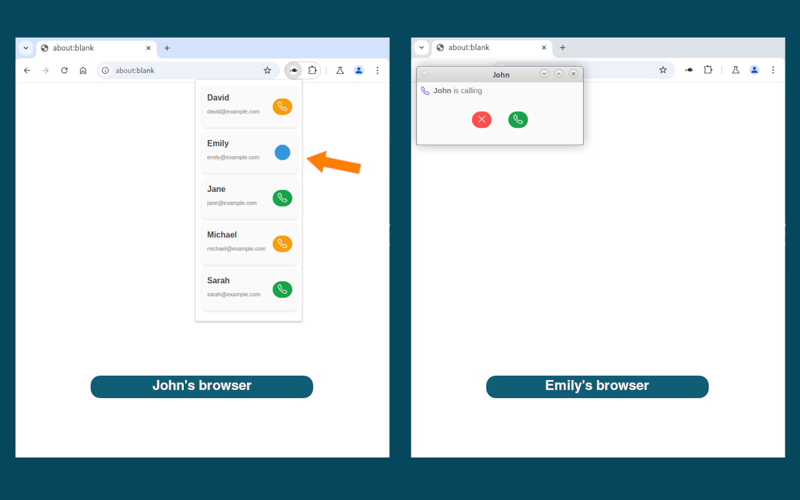

## Eparto Virtual Phone

Eparto Virtual Phone is a Chrome extension for [Eparto](https://app.eparto.net)
users. It allows users to use their browser as a virtual phone without having to
leave the browser or use additional devices. It is a simple and efficient way to
make and receive calls directly from the web browser.

### Features

- **Contact List**\
  View and call your contacts right from the extension’s popup.

- **Incoming Call Notifications**\
  When someone from your contact list calls, you’ll see a notification with
  options to accept or reject the call.

- **Audio and Video Calls**\
  You can accept calls and communicate via audio or video, depending on your
  preference.

Eparto Virtual Phone is designed to provide a simple and direct way to
communicate with your contacts, all within your browser. No need for additional
apps or devices, just open the extension and start calling.

### Installation

1. **Install Extension**\
   Add
   [Eparto Virtual Phone](https://chromewebstore.google.com/detail/eparto-virtual-phone/njihflnogjnjnmflicfongbnehhpkhmj)
   from Chrome Web Store.

2. **Register on Eparto**\
   Go to [eparto.net](https://app.eparto.net) and click the **Sign Up** button
   to create an account. Then, follow the prompts to complete your registration.

   This service is completely free and its source codes are publicly available
   at [Galaxy](https://github.com/emrahcom/galaxy).

3. **Create Private Key**\
   Click [here](https://app.eparto.net/pri/identity/key/add) to create your
   private key for the extension after registration.

4. **Set Private Key**\
   Go to the extension options page and enter your private key to complete the
   setup.

### Who Can Call Eparto Virtual Phone Users?

There are two ways to make calls with your Eparto Virtual Phone:

1. **Calls with Contacts**

   To make calls with someone in your contact list, follow these steps:
   1. Go to the [Contact Keys](https://app.eparto.net/pri/contact/invite) page
      on the Eparto website.

   2. Create a contact key and share it with the person you want to add to your
      contacts.

   3. The recipient will follow the link in the invitation and accept the
      invite.

   4. Once accepted, the person will be added to your contact list, and you can
      call each other using Eparto Virtual Phone.

2. **Calls via Public Phones**

   If you want to receive calls through a public phone, follow these steps:
   1. Go to the [Public Phones](https://app.eparto.net/pri/phone) page on the
      Eparto website.

   2. Create a public phone.

   3. Share its link or QR code with your friends, or display it on a website
      for others to find and call you.

### Privacy

Eparto Virtual Phone prioritizes the privacy. The extension communicates solely
with the configured backend server (_[eparto.net](https://app.eparto.net) by
default_) to facilitate its features. It does not track the browsing activity,
monitor other tabs or collect any information about the user's actions outside
of its intended functionality. All interactions are limited to what is necessary
to provide a secure and seamless virtual phone experience.

See [Privacy Policy](docs/privacy-policy.md) for more details.

If you want to install and use your own backend server, see
[Galaxy](https://github.com/emrahcom/galaxy).
